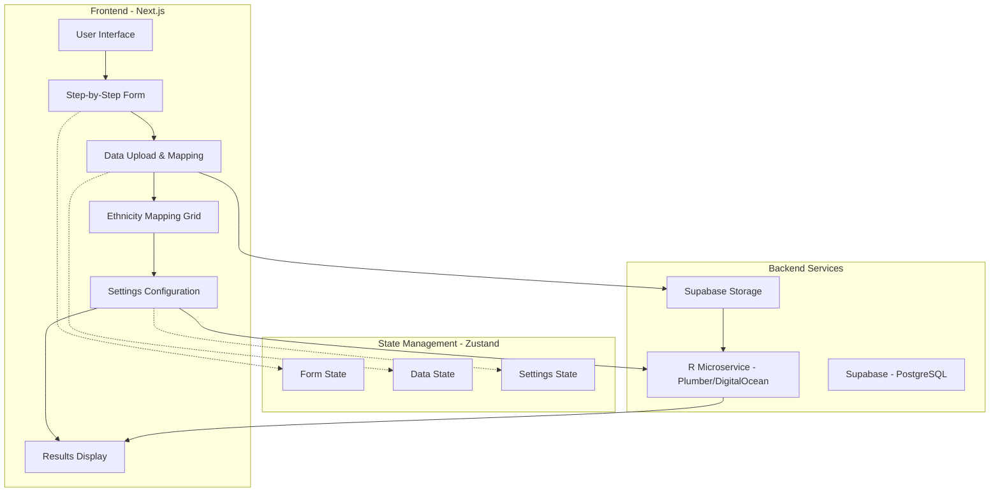
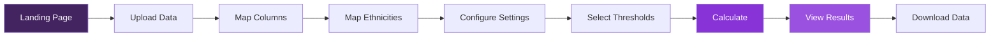
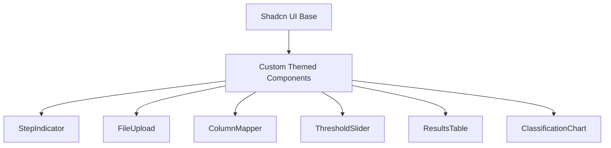
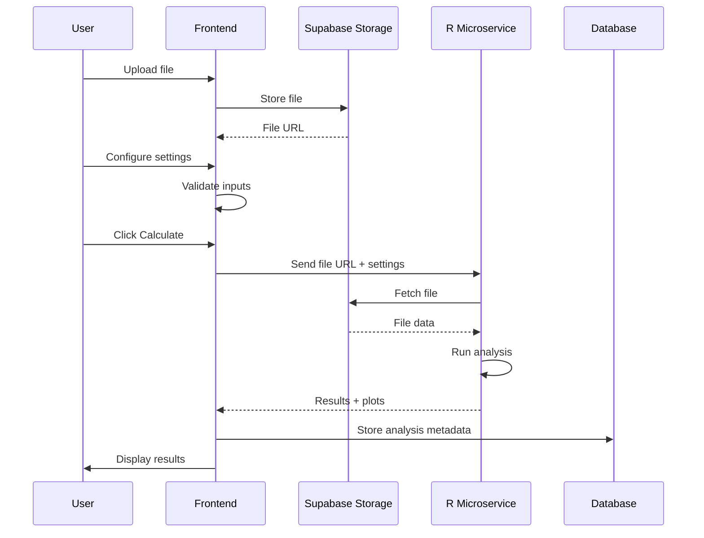

# BioHEART Resilience Calculator - Product Requirements Document

## 1. Executive Summary

### Product Vision

A web-based GUI application that makes the BioHEART Resilience R package accessible to non-technical researchers, enabling them to calculate resilience scores for their datasets without requiring R programming knowledge.

### Core Value Proposition

- Democratize access to advanced cardiovascular resilience analysis
- Remove technical barriers for researchers
- Provide guided, step-by-step analysis with best practices
- Ensure data quality through strict validation

## 2. Product Overview

### 2.1 Problem Statement

The BioHEART Resilience package provides sophisticated analysis for identifying resilient and susceptible individuals based on their Coronary Artery Calcium Score (CACS) relative to traditional cardiovascular risk scores. However, the current R-only implementation limits its use to technically proficient users.

### 2.2 Solution Architecture



### 2.3 Technical Stack

- **Frontend Framework**: Next.js with React 19
- **State Management**: Zustand
- **Data Fetching**: React Query
- **UI Components**: Tailwind CSS v5, Shadcn UI
- **Table Components**:
  - Tanstack Table (results display)
  - ReactGrid (ethnicity mapping)
- **Charts**: Recharts
- **Form Validation**: Zod
- **Backend**:
  - R analysis via Plumber on DigitalOcean
  - Supabase (PostgreSQL + Storage)
- **Analytics**: PostHog

## 3. Detailed Feature Requirements

### 3.1 User Flow Overview



### 3.2 Step-by-Step Form Implementation

#### Step 1: Data Upload

**Requirements:**

- Accept CSV, XLSX, and XLS files
- Display upload progress
- File size validation (max 50MB)
- Preview first 10 rows after upload
- Store file in Supabase Storage

**Validation:**

- File type checking
- Basic structure validation (has headers, has data)
- Character encoding detection

#### Step 2: Column Mapping

**Requirements:**

- Display all uploaded column names
- Provide dropdowns for mapping to required fields:
  - CACS (required)
  - Age (required)
  - Gender (required)
  - Total Cholesterol (required)
  - HDL Cholesterol (required)
  - Systolic BP (required)
  - Smoking Status (required)
  - Diabetes Status (required)
  - BP Medication (required)
  - Lipid Medication (optional)
  - Family History IHD (optional)
  - Ethnicity (optional)
  - Subject ID (optional)

**Features:**

- Fuzzy matching for automatic pre-mapping
- Visual indicators for mapped/unmapped fields
- Validation messages for incorrect mappings

#### Step 3: Ethnicity Mapping (Conditional)

**Requirements:**

- Only shown if ethnicity column is mapped
- ReactGrid implementation for mapping interface
- Dynamic grid based on unique ethnicity values in data
- Columns for each risk score that uses ethnicity:
  - ACC/AHA ASCVD (white, other, african-american)
  - MESA (white, african-american, chinese, hispanic)

**Interface Example:**

```
| Uploaded Data | ACC/AHA ASCVD | MESA      |
|---------------|---------------|-----------|
| Caucasian     | white         | white     |
| Asian         | other         | chinese   |
| Black         | african-american | african-american |
| Hispanic      | other         | hispanic  |
```

#### Step 4: Risk Score Settings

**Requirements:**

- Risk Scores Selection (multi-select):
  - Framingham Risk Score (FRS)
  - ACC/AHA ASCVD
  - MESA
  - SCORE2
- Risk Region for SCORE2:
  - Low (default)
  - Moderate
  - High
  - Very High
- Minimum Scores Required (1-4, default: 1)
- Cholesterol Unit:
  - mmol/L
  - mg/dL

#### Step 5: Classification Thresholds

**Requirements:**

- Percentile threshold inputs:
  - Resilient percentile (default: 20)
  - Reference low percentile (default: 40)
  - Reference high percentile (default: 60)
  - Susceptible percentile (default: 80)
- Visual representation of threshold ranges
- Validation: values must be 0-100 and in ascending order

### 3.3 Results Display

#### Data Table Requirements

- Tanstack Table implementation
- Columns:
  - Subject ID (if provided)
  - Original data columns
  - Calculated risk scores
  - Average normalized score
  - CACS percentile
  - Classification (Resilient/Reference/Susceptible/Other)
- Features:
  - Sorting
  - Filtering
  - Column visibility toggle
  - Export to CSV

#### Visualization Requirements

- Scatter plot using Recharts:
  - X-axis: Average Normalized Risk Score
  - Y-axis: CACS (log scale)
  - Color coding by classification
  - Interactive tooltips showing subject details
  - Click to highlight individual in table

### 3.4 Guidance System

#### Contextual Help

**Location**: Top of each form step
**Content**:

- Best practices for each step
- References to relevant literature
- Common pitfalls to avoid

**Examples:**

- Step 2: "Ensure cholesterol values are in consistent units"
- Step 3: "Consider population demographics when mapping ethnicities"
- Step 5: "Lower resilient percentiles identify more extreme phenotypes"

## 4. Design Specifications

### 4.1 Typography

- **Headings**: Neue Helvetica
- **Body Text**: Menlo

### 4.2 Color Palette

```
Primary Colors (Dark to Light Purple):
- #432460 - Primary Dark
- #331048 - Secondary Dark
- #8833d8 - Primary Action
- #9b51e0 - Secondary Action
- #9e8da7 - Muted
- #d5c9db - Light Background
```

### 4.3 UI Component Library



## 5. Data Flow Architecture

### 5.1 Client-Server Communication



### 5.2 State Management Structure

```typescript
interface AppState {
  // Form progression
  currentStep: number;
  completedSteps: Set<number>;

  // Data state
  uploadedFile: {
    name: string;
    url: string;
    columns: string[];
    preview: any[];
  };

  // Mapping state
  columnMappings: {
    [required_field: string]: string; // uploaded column name
  };

  ethnicityMappings: {
    [ethnicity_value: string]: {
      ascvd: string;
      mesa: string;
    };
  };

  // Settings state
  settings: {
    riskScores: string[];
    riskRegion: string;
    minScores: number;
    cholesterolUnit: "mmol/L" | "mg/dL";
    percentileThresholds: {
      resilient: number;
      reference_low: number;
      reference_high: number;
      susceptible: number;
    };
  };

  // Results state
  results: {
    data: any[];
    plots: {
      cacs_vs_risk: any;
      risk_distribution: any;
      percentile_distribution: any;
    };
    summary: {
      n_total: number;
      n_complete: number;
      classifications: {
        resilient: number;
        reference: number;
        susceptible: number;
        other: number;
      };
    };
  };
}
```

## 6. API Design

### 6.1 R Microservice Endpoints

#### POST /api/prepare-data

```json
{
  "file_url": "string",
  "column_mappings": {
    "cacs": "CAC_Score",
    "age": "Age"
    // ... other mappings
  },
  "cholesterol_unit": "mmol/L",
  "id_column": "PatientID"
}
```

#### POST /api/analyze

```json
{
  "prepared_data_id": "string",
  "settings": {
    "risk_scores": ["frs", "ascvd", "mesa"],
    "risk_region": "Low",
    "ethnicity_mappings": {
      // ... mappings
    },
    "percentile_thresholds": {
      "resilient": 20,
      "reference_low": 40,
      "reference_high": 60,
      "susceptible": 80
    },
    "min_scores": 1
  }
}
```

### 6.2 Response Format

```json
{
  "success": true,
  "data": {
    "results": [...],
    "plots": {
      "cacs_vs_risk": "plotly_json",
      "risk_distribution": "plotly_json",
      "percentile_distribution": "plotly_json"
    },
    "summary": {
      "n_total": 500,
      "n_complete": 485,
      "classifications": {
        "resilient": 97,
        "reference": 194,
        "susceptible": 97,
        "other": 97
      }
    }
  }
}
```

## 7. Validation Rules

### 7.1 Data Validation

- Age: 18-100 years
- Systolic BP: 70-250 mmHg
- Total Cholesterol: 100-500 mg/dL (or equivalent in mmol/L)
- HDL Cholesterol: 10-150 mg/dL (or equivalent in mmol/L)
- CACS: ≥ 0
- Binary fields: 0 or 1

### 7.2 Risk Score Specific Validations

- **FRS**: Age 30-74
- **ASCVD**:
  - Age 20-79
  - TC 130-320 mg/dL
  - HDL 20-100 mg/dL
  - SBP 90-200 mmHg
- **MESA**: Age 45-85
- **SCORE2**: Optimal for age 40-75

## 8. Error Handling

### 8.1 User-Facing Errors

- Clear, actionable error messages
- Inline validation feedback
- Step-specific error states
- Graceful fallbacks for partial failures

### 8.2 System Errors

- R microservice timeouts (30s limit)
- File upload failures
- Data validation errors
- Network connectivity issues

## 9. Performance Requirements

### 9.1 Response Times

- File upload: < 10s for 50MB
- Column detection: < 2s
- Analysis calculation: < 30s for 10,000 rows
- Results rendering: < 1s

### 9.2 Scalability

- Support concurrent users
- Queue system for R analysis requests
- Caching of analysis results

## 10. Security Considerations

### 10.1 Data Privacy

- Encrypted file storage
- Secure transmission (HTTPS)
- Temporary file storage (auto-delete after 24h)
- No PII logging

### 10.2 Access Control

- Rate limiting on API endpoints
- File size restrictions
- Input sanitization

## 11. Future Considerations

### 11.1 Potential Enhancements

- Batch processing for multiple datasets
- Saved analysis templates
- Collaboration features
- Advanced visualization options

### 11.2 R Package Modifications

Based on the web implementation needs:

- Return plotly JSON instead of ggplot objects
- Add progress callbacks for long operations
- Implement chunked processing for large datasets
- Add validation-only mode for pre-flight checks

## 12. Success Metrics

### 12.1 User Adoption

- Number of analyses completed
- User retention rate
- Time to complete analysis

### 12.2 Technical Performance

- Analysis success rate
- Average processing time
- Error rate by step

### 12.3 User Satisfaction

- Step completion rates
- Feature usage patterns
- User feedback scores
