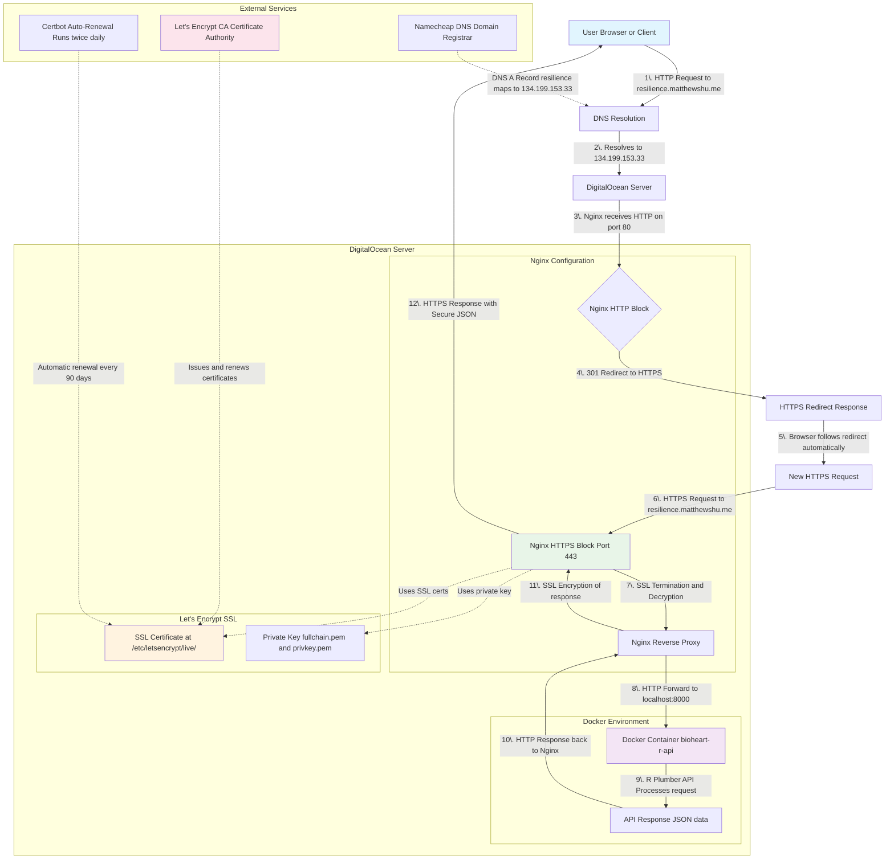

This is documentation to ensure I remember and understand how my back-end works.

DNS subdomain resilience.matthewshu.me points towards server IP of DigitalOcean droplet. Nginx HTTP block (port 80) catches requests that are http:// and redirects to https:// to ensure all traffic is secure. Nginx HTTPS block (port 443) receives encrypted request and uses Let's Encrypt SSL cert to decrypt traffic. Nginx reverse proxy then forwards request as plain HTTP to localhost with all the original headers preserved. Docker container running R Plumber API receives request and CORS filter checks if request allowed. R Plumber API returns JSON response to Nginx which encrypts response with SSL cert and send HTTPS response back to user.

The other thing to note is that often AI will produce code that has serious security flaws like exposing your the IP and port of your Docker Container for instance such that irrespective of CORS policies you have set within an individal API file, one can still make curl requests since CORS only protects against browser-based cross origin requests. You can imagine that if you had commit history and a public repo, one could inspect your .env that you accidentally pushed or what you've written in your personal documentation and use that to gain access - bypassing nginx entirely. So some things important to check are

1. Make sure Docker only binds to localhost `sudo ss -tlnp | grep :8000`
2. Make sure Firewalls do not allow direct port access `sudo ufw status numbered`
3. This request for instance should time out `http://134.199.153.33:8000/health`

