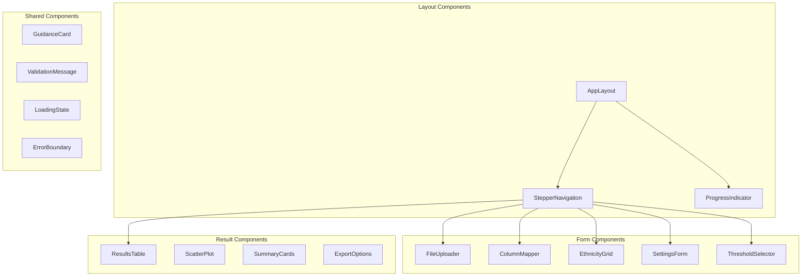
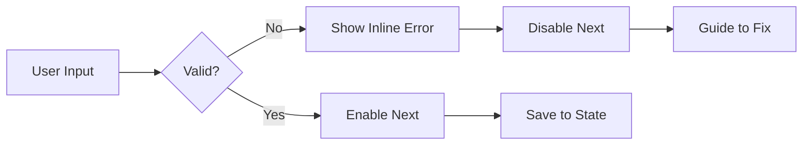

# BioHEART Resilience Calculator - UI Implementation Plan

## 1. Component Architecture



## 2. Page Layouts & Wireframes

### 2.1 Landing Page

```
┌─────────────────────────────────────────────────────────────┐
│  [Logo] BioHEART Resilience Calculator                      │
├─────────────────────────────────────────────────────────────┤
│                                                             │
│  ┌─────────────────────────────────────────────────────┐  │
│  │  Calculate Cardiovascular Resilience Scores          │  │
│  │                                                       │  │
│  │  Identify resilient and susceptible individuals      │  │
│  │  based on their CACS relative to risk scores        │  │
│  │                                                       │  │
│  │           [Start Analysis] →                         │  │
│  └─────────────────────────────────────────────────────┘  │
│                                                             │
│  ┌─────────┐  ┌─────────┐  ┌─────────┐  ┌─────────┐      │
│  │ Upload  │  │ Map     │  │ Analyse │  │ Export  │      │
│  │ Data    │  │ Fields  │  │ Risk    │  │ Results │      │
│  └─────────┘  └─────────┘  └─────────┘  └─────────┘      │
│                                                             │
└─────────────────────────────────────────────────────────────┘
```

### 2.2 Step Navigation Layout

```
┌─────────────────────────────────────────────────────────────┐
│  BioHEART Resilience Calculator                    [Help ?] │
├─────────────────────────────────────────────────────────────┤
│  ┌─────────────────────────────────────────────────────┐   │
│  │  (1)──────(2)──────(3)──────(4)──────(5)──────(6)  │   │
│  │  Upload   Map    Ethnicity Settings Threshold Result│   │
│  └─────────────────────────────────────────────────────┘   │
├─────────────────────────────────────────────────────────────┤
│                                                             │
│  [Step Content Area]                                        │
│                                                             │
│                                                             │
│  ┌─────────────────────────┐  ┌────────────────────────┐  │
│  │     [← Previous]        │  │    [Next →]            │  │
│  └─────────────────────────┘  └────────────────────────┘  │
└─────────────────────────────────────────────────────────────┘
```

## 3. Component Specifications

### 3.1 FileUploader Component

```typescript
interface FileUploaderProps {
  onFileSelect: (file: File) => void;
  onUploadComplete: (data: UploadedFileData) => void;
  acceptedFormats: string[];
  maxSize: number;
}
```

**Visual Design:**

```
┌─────────────────────────────────────────────────────────────┐
│  ┌ ─ ─ ─ ─ ─ ─ ─ ─ ─ ─ ─ ─ ─ ─ ─ ─ ─ ─ ─ ─ ─ ─ ─ ─ ─ ┐   │
│  │                                                      │   │
│  │              📁 Drop your file here                  │   │
│  │                                                      │   │
│  │           or [Browse Files] to upload                │   │
│  │                                                      │   │
│  │         Accepted: CSV, XLSX, XLS (max 50MB)         │   │
│  └ ─ ─ ─ ─ ─ ─ ─ ─ ─ ─ ─ ─ ─ ─ ─ ─ ─ ─ ─ ─ ─ ─ ─ ─ ─ ┘   │
│                                                             │
│  ┌─────────────────────────────────────────────────────┐   │
│  │ ℹ️ Best Practice:                                    │   │
│  │ Ensure your data includes CACS values and basic     │   │
│  │ cardiovascular risk factors for all subjects.       │   │
│  └─────────────────────────────────────────────────────┘   │
└─────────────────────────────────────────────────────────────┘
```

### 3.2 ColumnMapper Component

```typescript
interface ColumnMapperProps {
  uploadedColumns: string[];
  requiredFields: FieldMapping[];
  optionalFields: FieldMapping[];
  onMappingChange: (mappings: Record<string, string>) => void;
}
```

**Visual Design:**

```
┌─────────────────────────────────────────────────────────────┐
│  Map Your Data Columns                                      │
├─────────────────────────────────────────────────────────────┤
│                                                             │
│  Required Fields                                            │
│  ┌─────────────────────┐  ┌─────────────────────────┐     │
│  │ CACS Score         │  │ [Select Column ▼]       │ ✓   │
│  └─────────────────────┘  └─────────────────────────┘     │
│  ┌─────────────────────┐  ┌─────────────────────────┐     │
│  │ Age                │  │ [Age_Years ▼]           │ ✓   │
│  └─────────────────────┘  └─────────────────────────┘     │
│  ┌─────────────────────┐  ┌─────────────────────────┐     │
│  │ Gender             │  │ [Select Column ▼]       │ ⚠️  │
│  └─────────────────────┘  └─────────────────────────┘     │
│                                                             │
│  Optional Fields                                            │
│  ┌─────────────────────┐  ┌─────────────────────────┐     │
│  │ Subject ID         │  │ [PatientID ▼]           │ ✓   │
│  └─────────────────────┘  └─────────────────────────┘     │
│                                                             │
│  ⚠️ Gender column must contain 'male'/'female' values      │
└─────────────────────────────────────────────────────────────┘
```

### 3.3 EthnicityGrid Component

```typescript
interface EthnicityGridProps {
  uniqueEthnicities: string[];
  onMappingComplete: (mappings: EthnicityMapping) => void;
}
```

**Visual Implementation using ReactGrid:**

```
┌─────────────────────────────────────────────────────────────┐
│  Map Ethnicities to Risk Score Categories                   │
├─────────────────────────────────────────────────────────────┤
│                                                             │
│  ┌─────────────┬──────────────┬──────────────┐            │
│  │ Your Data   │ ACC/AHA      │ MESA         │            │
│  ├─────────────┼──────────────┼──────────────┤            │
│  │ Caucasian   │ [white ▼]    │ [white ▼]    │            │
│  ├─────────────┼──────────────┼──────────────┤            │
│  │ Asian       │ [other ▼]    │ [chinese ▼]  │            │
│  ├─────────────┼──────────────┼──────────────┤            │
│  │ African     │ [aa ▼]       │ [aa ▼]       │            │
│  ├─────────────┼──────────────┼──────────────┤            │
│  │ Hispanic    │ [other ▼]    │ [hispanic ▼] │            │
│  └─────────────┴──────────────┴──────────────┘            │
│                                                             │
│  ┌─────────────────────────────────────────────────────┐   │
│  │ ℹ️ Note: Risk scores were developed on specific      │   │
│  │ populations. Consider your cohort demographics       │   │
│  │ when mapping ethnicities. [Learn more]              │   │
│  └─────────────────────────────────────────────────────┘   │
└─────────────────────────────────────────────────────────────┘
```

### 3.4 SettingsForm Component

```
┌─────────────────────────────────────────────────────────────┐
│  Configure Analysis Settings                                │
├─────────────────────────────────────────────────────────────┤
│                                                             │
│  Risk Scores to Calculate                                   │
│  ┌───┐ Framingham Risk Score (FRS)                        │
│  │ ✓ │ ACC/AHA ASCVD                                      │
│  ├───┤ MESA                                               │
│  │ ✓ │ SCORE2                                             │
│  └───┘                                                     │
│                                                             │
│  SCORE2 Risk Region                                        │
│  ○ Low  ● Moderate  ○ High  ○ Very High                   │
│                                                             │
│  Cholesterol Unit in Your Data                             │
│  ● mmol/L  ○ mg/dL                                        │
│                                                             │
│  Minimum Valid Scores Required                             │
│  [1] ────●──────── 4                                      │
│                                                             │
└─────────────────────────────────────────────────────────────┘
```

### 3.5 ThresholdSelector Component

```
┌─────────────────────────────────────────────────────────────┐
│  Set Classification Thresholds                              │
├─────────────────────────────────────────────────────────────┤
│                                                             │
│  Define percentile cutoffs for each classification:        │
│                                                             │
│  Resilient (bottom)                                         │
│  0% ────●──────── 100%  [20]%                             │
│                                                             │
│  Reference Range                                            │
│  0% ──────●────●─ 100%  [40]% - [60]%                     │
│                                                             │
│  Susceptible (top)                                          │
│  0% ──────────●── 100%  [80]%                             │
│                                                             │
│  ┌─────────────────────────────────────────────────────┐   │
│  │ Visual Preview:                                      │   │
│  │ ████ Resilient █████ Reference █████ Other ████ Susc│   │
│  │ 0%   20%        40%            60%         80% 100% │   │
│  └─────────────────────────────────────────────────────┘   │
│                                                             │
└─────────────────────────────────────────────────────────────┘
```

### 3.6 ResultsTable Component

```typescript
interface ResultsTableProps {
  data: AnalysisResult[];
  onRowClick: (row: AnalysisResult) => void;
  onExport: () => void;
}
```

**Implementation with Tanstack Table:**

```
┌─────────────────────────────────────────────────────────────┐
│  Analysis Results (485 subjects)              [Export CSV]  │
├─────────────────────────────────────────────────────────────┤
│  [Search...] [Filter ▼] [Columns ▼]                        │
│                                                             │
│  ┌────┬──────┬─────┬──────┬──────┬────────┬─────────────┐ │
│  │ ID │ Age  │ CACS│ FRS  │ ASCVD│ Avg    │ Class       │ │
│  ├────┼──────┼─────┼──────┼──────┼────────┼─────────────┤ │
│  │ 001│ 55   │ 0   │ 12.5 │ 15.2 │ -1.23  │ Resilient   │ │
│  │ 002│ 62   │ 450 │ 18.3 │ 22.1 │ 0.45   │ Reference   │ │
│  │ 003│ 48   │ 850 │ 8.2  │ 10.5 │ -0.89  │ Susceptible │ │
│  │ 004│ 71   │ 125 │ 25.6 │ 28.3 │ 1.15   │ Reference   │ │
│  └────┴──────┴─────┴──────┴──────┴────────┴─────────────┘ │
│                                                             │
│  [← Previous] Page 1 of 25 [Next →]                       │
└─────────────────────────────────────────────────────────────┘
```

### 3.7 ScatterPlot Component

```
┌─────────────────────────────────────────────────────────────┐
│  CACS vs Average Normalized Risk Score                     │
├─────────────────────────────────────────────────────────────┤
│     1000 │                              ● Susceptible       │
│          │                    ●    ●                        │
│      100 │           ●    ●      ●                         │
│  C       │      ●        ●   ●                             │
│  A    10 │   ●      ●  ●   ●                              │
│  C       │ ●    ●  ●    ●                                  │
│  S     1 │●  ● ●   ●                                       │
│          │● ●                                              │
│      0.1 │                                                 │
│          └─────────────────────────────────────────────    │
│          -2    -1     0     1     2                        │
│              Average Normalized Risk Score                  │
│                                                             │
│  ● Resilient  ● Reference  ● Susceptible  ● Other         │
└─────────────────────────────────────────────────────────────┘
```

## 4. Design System Implementation

### 4.1 Theme Configuration (tailwind.config.ts)

```typescript
module.exports = {
  theme: {
    extend: {
      colors: {
        primary: {
          900: "#432460",
          800: "#331048",
          600: "#8833d8",
          500: "#9b51e0",
          400: "#9e8da7",
          200: "#d5c9db",
        },
      },
      fontFamily: {
        heading: ["Neue Helvetica", "sans-serif"],
        body: ["Menlo", "monospace"],
      },
    },
  },
};
```

### 4.2 Component Library Structure

```
src/
├── components/
│   ├── layout/
│   │   ├── AppLayout.tsx
│   │   ├── StepperNavigation.tsx
│   │   └── ProgressIndicator.tsx
│   ├── forms/
│   │   ├── FileUploader.tsx
│   │   ├── ColumnMapper.tsx
│   │   ├── EthnicityGrid.tsx
│   │   ├── SettingsForm.tsx
│   │   └── ThresholdSelector.tsx
│   ├── results/
│   │   ├── ResultsTable.tsx
│   │   ├── ScatterPlot.tsx
│   │   ├── SummaryCards.tsx
│   │   └── ExportOptions.tsx
│   └── shared/
│       ├── GuidanceCard.tsx
│       ├── ValidationMessage.tsx
│       ├── LoadingState.tsx
│       └── ErrorBoundary.tsx
```

## 5. Interaction Patterns

### 5.1 Form Validation Flow



### 5.2 Loading States

- **File Upload**: Progress bar with percentage
- **Column Detection**: Skeleton loader
- **Analysis**: Multi-step progress with current action
- **Results**: Staggered fade-in animation

### 5.3 Error Handling UI

```
┌─────────────────────────────────────────────────────────────┐
│  ⚠️ Analysis Error                                          │
├─────────────────────────────────────────────────────────────┤
│                                                             │
│  Unable to calculate MESA score for 45 subjects:           │
│  - 23 subjects outside age range (45-85)                   │
│  - 22 subjects missing ethnicity mapping                   │
│                                                             │
│  [View Affected Rows]  [Continue Without MESA]  [Go Back]  │
└─────────────────────────────────────────────────────────────┘
```

## 6. Mobile Responsiveness

### 6.1 Breakpoint Strategy

- Desktop: 1024px+ (full layout)
- Tablet: 768px-1023px (condensed navigation)
- Mobile: <768px (vertical stack, simplified tables)

### 6.2 Mobile Adaptations

- Stepper → Vertical progress indicator
- Table → Card-based list view
- Side-by-side → Stacked layouts
- Hover states → Tap interactions

## 7. Accessibility Requirements

### 7.1 WCAG 2.1 AA Compliance

- Color contrast ratios: 4.5:1 minimum
- Keyboard navigation for all interactions
- Screen reader announcements for state changes
- Focus indicators on all interactive elements

### 7.2 ARIA Implementation

```html
<div role="navigation" aria-label="Analysis steps">
  <ol role="list">
    <li role="listitem" aria-current="step">Upload Data</li>
    <li role="listitem">Map Columns</li>
  </ol>
</div>
```

## 8. Performance Optimizations

### 8.1 Code Splitting

```typescript
const ResultsView = lazy(() => import("./components/results/ResultsView"));
const EthnicityMapper = lazy(() => import("./components/forms/EthnicityGrid"));
```

### 8.2 Data Handling

- Virtual scrolling for large tables (>1000 rows)
- Debounced search inputs
- Memoized expensive calculations
- Progressive data loading

## 9. Implementation Priority

### Phase 1: Core Flow

1. Basic layout and navigation
2. File upload functionality
3. Column mapping interface
4. Simple results display

### Phase 2: Enhanced Features

1. Ethnicity mapping grid
2. Advanced settings configuration
3. Interactive visualizations
4. Export functionality

### Phase 3: Polish

1. Comprehensive error handling
2. Loading state refinements
3. Mobile optimizations
4. Analytics integration
